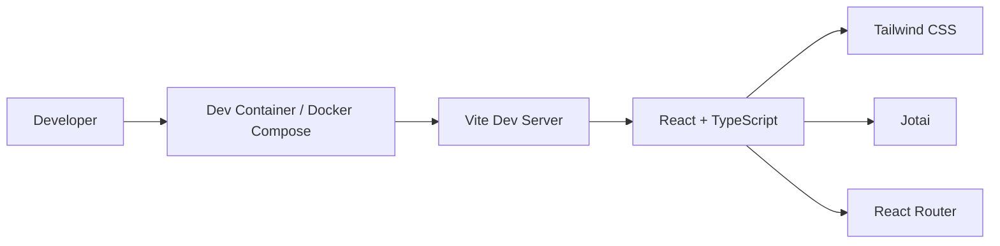
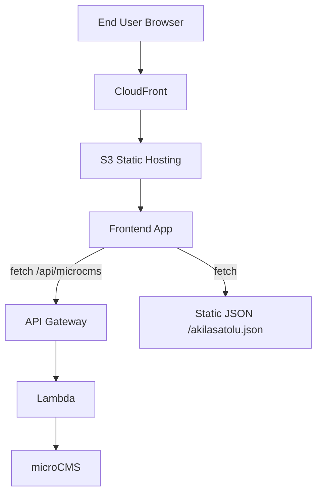
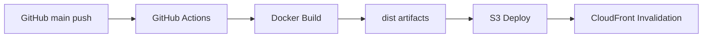

#### Thank you for visiting my GitHub.
#### I'm akilasatolu.

#### The site below has more information about me.
#### I’d be glad if you find something that interests you.

https://d2c586l4e7obh2.cloudfront.net/

##### This site is built with TypeScript and React, styled with Tailwind CSS, and optimized using Vite for fast development. Font Awesome delivers rich icons for an engaging UI, while Jotai provides simple and flexible state management. Docker ensures consistent deployments, and GitHub Actions automates the build process. The site is hosted on AWS S3 and delivered globally through CloudFront for high performance and reliability. In addition, dynamic content is served through a serverless API layer using AWS API Gateway and AWS Lambda. The Lambda function fetches data from microCMS and returns it to the frontend, enabling secure and efficient data handling while keeping API keys hidden. This architecture allows the frontend to communicate via a unified /api endpoint, improving scalability and maintainability.

---

## Architecture Overview

### 1) Development Environment (Local)

- Local development runs on `Vite`.
- The frontend core is `React + TypeScript`.
- UI is built with `Tailwind CSS`, and state is managed with `Jotai`.

### 2) Production Architecture (Delivery and Data Flow)

- Static assets are hosted on `S3` and delivered through `CloudFront`.
- Data comes from two sources: static JSON and the microCMS API route.
- Dynamic API handling uses `API Gateway + Lambda` (serverless).

### 3) CI/CD Flow

- A push to `main` triggers automated deployment.
- The app is built with `Docker`, and `dist` is generated.
- Artifacts are synced to `S3`, then `CloudFront` cache is invalidated.